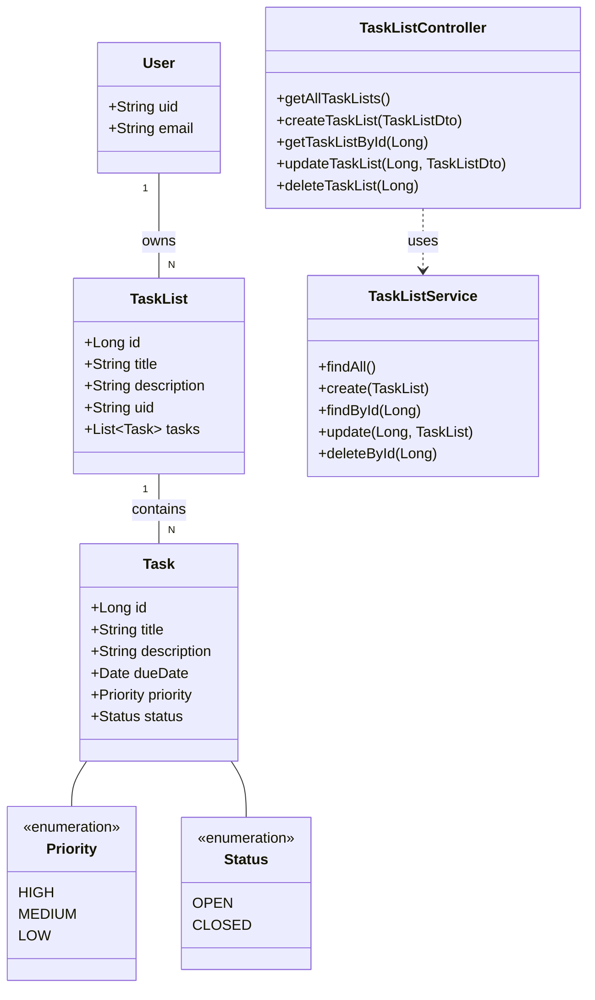

# PROJECT PROPOSAL: Tasks Application

**TEAM MEMBERS:** [Please list your team members here]

## PROJECT DESCRIPTION

### Overview

This project is a modern, full-stack task management application designed to help users organize their work and track their progress. The backend is built with Spring Boot, providing a robust and scalable REST API, while the frontend is a responsive and user-friendly interface developed with React and TypeScript. The application enables users to create and manage task lists, add tasks to these lists, and monitor their completion status.

### Problem Addressed

In today's fast-paced environment, individuals and teams often struggle to keep track of their tasks and deadlines. This can lead to missed deadlines, reduced productivity, and a lack of clarity on project progress. Existing task management tools can be overly complex or lack the specific features needed for effective task tracking. This project aims to solve this problem by providing a simple, intuitive, and efficient tool for managing tasks.

### Functionality and Features

The application will provide the following key features:

1.  **Task List Management**: Users can create, update, and delete task lists to organize their tasks into different categories or projects.
2.  **Task Management**: Within each task list, users can create, update, and delete individual tasks.
3.  **Task Prioritization**: Tasks can be assigned a priority (High, Medium, Low) to help users focus on what's most important.
4.  **Task Status Tracking**: Tasks can be assigned a status (Open, Closed) to track their progress.
5.  **Task List Progress Tracking**: The application automatically calculates and displays the progress of each task list based on the number of completed tasks.
6.  **Dark/Light Mode**: The frontend will include a theme-switching option to allow users to choose between a dark or light user interface for their comfort.
7.  **User Authentication**: Secure user authentication will be implemented to ensure that users can only access their own task lists.
8.  **RESTful API**: The backend provides a well-defined RESTful API for all frontend-to-backend communication.
9.  **Global Error Handling**: The backend includes a global error handling mechanism to provide consistent and informative error responses to the frontend.
10. **CORS Configuration**: The backend is configured to handle Cross-Origin Resource Sharing (CORS) requests from the frontend, enabling seamless integration.

## FEATURES

### 1. Task List Management

*   **Purpose**: To allow users to group their tasks into meaningful categories, such as work, personal, or specific projects.
*   **Functionality**: Users can create new task lists by providing a title and description. They can also update the title and description of existing task lists or delete them entirely. The user interface displays all task lists in a clear and organized manner.
*   **Integration**: This is a core architectural feature. The backend provides dedicated REST endpoints (`/task-lists`) for these operations, and the frontend includes UI components for creating, viewing, and editing task lists.

### 2. Task Management

*   **Purpose**: To enable users to add, modify, and remove individual tasks within a task list.
*   **Functionality**: Users can add tasks with a title, description, and due date. They can also edit these details or delete tasks that are no longer needed. The interface displays all tasks in a list, with options to view and edit each task.
*   **Integration**: This feature builds on Task List Management. The backend provides nested REST endpoints (`/task-list/{task_list_id}/tasks`) for task operations, and the frontend UI allows users to manage tasks within the context of a selected task list.

### 3. Task Prioritization

*   **Purpose**: To help users identify and focus on their most important tasks.
*   **Functionality**: When creating or updating a task, users can assign a priority level (High, Medium, or Low). The UI visually distinguishes tasks by priority (e.g., using color codes), and users can sort or filter tasks by priority.
*   **Integration**: This feature extends the Task entity in the backend with a `priority` field. The frontend includes controls (e.g., dropdowns) in the task forms and filters in the task view to manage and display this information.

### 4. Task Status Tracking

*   **Purpose**: To allow users to track the progress of their tasks from start to finish.
*   **Functionality**: Users can set a status for each task, such as `OPEN` or `CLOSED`. This status is clearly displayed for each task, making it easy to see what is completed and what is pending.
*   **Integration**: The backend Task entity includes a `status` field. The frontend provides mechanisms (e.g., checkboxes or buttons) to update the task status, which triggers an API call to the backend to persist the change.

### 5. Task List Progress Tracking

*   **Purpose**: To provide a high-level overview of the completion status of an entire task list.
*   **Functionality**: The application automatically calculates the percentage of completed tasks within each task list. This progress is displayed visually, for instance, with a progress bar next to each task list's name.
*   **Integration**: This is a derived data feature. The backend calculates the progress in the `TaskListDto` before sending it to the frontend. The frontend then uses this data to render the progress bar component for each task list.

### 6. Dark/Light Mode

*   **Purpose**: To provide a more comfortable viewing experience for users in different lighting conditions and to reduce eye strain.
*   **Functionality**: The frontend includes a toggle switch that allows users to switch between a light and a dark theme. The application will remember the user's preference and apply it automatically on their next visit.
*   **Integration**: This is a frontend-specific feature implemented using modern CSS and a theme management library in React (like Context API or Redux) to dynamically apply styles across the application.

### 7. User Authentication

*   **Purpose**: To secure the application and ensure that users can only access their own task lists and tasks.
*   **Functionality**: Users can sign up and log in using an email and password. The application will maintain the user's session and protect their data from unauthorized access.
*   **Integration**: This feature is implemented using Firebase Authentication on the frontend. The backend is set up to receive and validate Firebase ID tokens with each API request to ensure that the user is authenticated and authorized to perform the requested action.

### 8. RESTful API

*   **Purpose**: To establish a clean, standardized, and stateless communication protocol between the frontend and the backend.
*   **Functionality**: The backend exposes a set of RESTful endpoints for every available action (e.g., `GET /task-lists`, `POST /task-lists`, `PUT /task-lists/{id}`). The API uses standard HTTP methods and status codes to represent operations and their outcomes.
*   **Integration**: This is a fundamental backend feature. The entire frontend application is built around consuming this API to fetch and manipulate data. Tools like Postman are used during development to test and validate the API endpoints.

### 9. Global Error Handling

*   **Purpose**: To ensure that backend errors are handled gracefully and result in consistent, user-friendly error messages on the frontend.
*   **Functionality**: The backend uses a `@ControllerAdvice` to intercept exceptions thrown from any controller. It then formats the error information into a standardized JSON object, including an HTTP status, a clear message, and the request URI.
*   **Integration**: This backend mechanism simplifies frontend development. The frontend can implement a single logic to handle all API errors, displaying the message from the backend in a notification or an alert, which improves the user experience.

### 10. CORS Configuration

*   **Purpose**: To allow the frontend application, running on a different origin (e.g., `localhost:5173`), to make requests to the backend API (e.g., on `localhost:8080`).
*   **Functionality**: The backend implements a CORS filter that explicitly allows requests from the frontend's origin. It permits all standard HTTP methods and headers required for the application to function correctly.
*   **Integration**: This is a critical configuration in `WebConfig.java`. Without it, browsers would block all frontend API requests due to the Same-Origin Policy, making the full-stack application non-functional.

## TECHNOLOGIES AND TOOLS

*   **Backend**: IntelliJ IDEA (Java with Spring Boot)
*   **Frontend**: VSCode (React with TypeScript, HTML, & CSS)
*   **Database**: PostgreSQL
*   **Testing**: Postman for API testing

## UML DIAGRAMS

```mermaid
usecase "Tasks Application" {
    actor User

    rectangle "Task Management" {
        User -- (Manage Task Lists)
        User -- (Manage Tasks)
        User -- (View Task List Progress)

        (Manage Tasks) ..> (Set Task Priority) : <<extends>>
        (Manage Tasks) ..> (Set Task Status) : <<extends>>
    }

    rectangle "System" {
        User -- (Authenticate)
        User -- (Toggle Theme)
    }

    (Manage Task Lists) ..> (Authenticate) : <<includes>>
    (Manage Tasks) ..> (Authenticate) : <<includes>>
}
```



### Activity Diagrams

**Feature 1: Task List Management**
```mermaid
activityDiagram
    title Task List Management

    |User| 
    start
    :Accesses the application;
    
    |Frontend|
    :Fetches and displays existing task lists;
    
    |User|
    :Decides to create, update, or delete a list;
    switch (User Action)
    case (Create)
        :Clicks 'Create New List';
        |Frontend|
        :Displays a form for new list details;
        |User|
        :Fills in Title and Description;
        :Submits form;
        |Frontend|
        :Sends POST request to /task-lists;
        |Backend|
        :Receives request;
        :Validates data;
        :Saves new TaskList to Database;
        :Returns new TaskList object with ID;
        |Frontend|
        :Receives response;
        :Adds new list to the UI;

    case (Update)
        :Selects an existing list and clicks 'Edit';
        |Frontend|
        :Displays a form pre-filled with list details;
        |User|
        :Modifies Title or Description;
        :Submits form;
        |Frontend|
        :Sends PUT request to /task-lists/{id};
        |Backend|
        :Receives request;
        :Finds and updates TaskList in Database;
        :Returns updated TaskList object;
        |Frontend|
        :Receives response;
        :Updates the list in the UI;
        
    case (Delete)
        :Selects a list and clicks 'Delete';
        |Frontend|
        :Shows confirmation dialog;
        |User|
        :Confirms deletion;
        |Frontend|
        :Sends DELETE request to /task-lists/{id};
        |Backend|
        :Receives request;
        :Deletes TaskList from Database;
        :Returns success status (204 No Content);
        |Frontend|
        :Receives response;
        :Removes the list from the UI;
    endswitch

    |User|
    :Views updated list of task lists;
    stop
```

**Feature 2: Task Management**
```mermaid
activityDiagram
    title Task Management

    |User|
    start
    :Selects a Task List;

    |Frontend|
    :Fetches and displays tasks for the selected list;

    |User|
    :Decides to add, edit, or delete a task;
    switch (User Action)
    case (Add)
        :Clicks 'Add Task';
        |Frontend|
        :Displays a form for new task details;
        |User|
        :Fills in task details (title, description, etc.);
        :Submits form;
        |Frontend|
        :Sends POST request to /task-lists/{listId}/tasks;
        |Backend|
        :Receives request, creates new Task;
        :Adds Task to the Task List in Database;
        :Returns new Task object;
        |Frontend|
        :Receives response, adds new task to UI;

    case (Edit)
        :Selects an existing task and clicks 'Edit';
        |Frontend|
        :Displays form pre-filled with task details;
        |User|
        :Modifies task details;
        :Submits form;
        |Frontend|
        :Sends PUT request to /tasks/{id};
        |Backend|
        :Receives request, updates Task in Database;
        :Returns updated Task object;
        |Frontend|
        :Receives response, updates task in UI;

    case (Delete)
        :Selects a task and clicks 'Delete';
        |Frontend|
        :Shows confirmation dialog;
        |User|
        :Confirms deletion;
        |Frontend|
        :Sends DELETE request to /tasks/{id};
        |Backend|
        :Receives request, deletes Task from Database;
        :Returns success status;
        |Frontend|
        :Receives response, removes task from UI;
    endswitch

    |User|
    :Views updated tasks;
    stop
```

**Feature 3: Task Prioritization**
```mermaid
activityDiagram
    title Task Prioritization
    
    |User|
    start
    :Opens the 'Edit Task' form;
    :Finds the 'Priority' dropdown/selector;
    
    |Frontend|
    :Displays priority options (High, Medium, Low);
    
    |User|
    :Selects a new priority;
    :Saves the task form;
    
    |Frontend|
    :Sends PUT request to /tasks/{id} with updated task data;
    note right: The request body contains the new priority.
    
    |Backend|
    :Receives the request;
    :Validates the data;
    :Updates the 'priority' field for the specific task in the database;
    :Returns the updated task object;
    
    |Frontend|
    :Receives the successful response;
    :Updates the UI to reflect the new priority;
    note left: e.g., changes the color of the task item.
    
    |User|
    :Sees the updated priority on the task;
    stop
```

**Feature 4: Task Status Tracking**
```mermaid
activityDiagram
    title Task Status Tracking

    |User|
    start
    :Views a list of tasks;
    :Identifies a task to mark as complete;
    :Clicks the status checkbox/button for that task;

    |Frontend|
    :Sends PUT request to /tasks/{id};
    note right: Request body contains the new status ('OPEN' or 'CLOSED').

    |Backend|
    :Receives the request;
    :Updates the 'status' field for the task in the database;
    :Returns the updated task object;

    |Frontend|
    :Receives the successful response;
    :Updates the UI for that task;
    note left: e.g., applies a strikethrough style and updates the progress bar.

    |User|
    :Sees the task status has changed;
    stop
```

**Feature 5: Task List Progress Tracking**
```mermaid
activityDiagram
  title Task List Progress Tracking

  |Frontend|
  start
  :Makes a GET request to /task-lists;

  |Backend|
  :Receives the request;
  :Fetches all Task Lists for the user from the database;
  :For each Task List
    :Fetch all associated Tasks;
    :Calculate completion percentage:
    (Number of Tasks with status 'CLOSED' / Total number of Tasks) * 100;
    :Create a TaskListDto and include the calculated percentage;
  :endfor;
  :Returns a list of TaskListDto objects to the frontend;

  |Frontend|
  :Receives the list of task lists with progress data;
  :For each task list, render its details;
  :Renders a progress bar component using the progress percentage value;

  |User|
  :Views the task lists with their corresponding progress bars;
  stop
```

**Feature 6: Dark/Light Mode**
```mermaid
activityDiagram
    title Dark/Light Mode Toggle

    |User|
    start
    :Clicks the theme toggle button;

    |Frontend|
    :Reads the current theme state (e.g., from React Context);
    :if (current theme is 'light') then (switch to dark)
        :Applies 'dark' CSS class to the main app container;
        :Updates the theme state to 'dark';
        :Saves 'dark' to browser's localStorage;
    :else (switch to light)
        :Removes 'dark' CSS class from the main app container;
        :Updates the theme state to 'light';
        :Saves 'light' to browser's localStorage;
    :endif;

    |User|
    :Sees the UI theme change instantly;
    stop
```

**Feature 7: User Authentication**
```mermaid
activityDiagram
    title User Authentication

    |User|
    start
    :Navigates to the application;

    |Frontend|
    :Checks for an existing session/token;
    if (Token exists and is valid?) then (yes)
        :Fetches user's data;
        :Renders the main application (dashboard);
    else (no)
        :Redirects to the Login/Sign Up page;
        |User|
        :Fills in credentials (email/password);
        :Submits the form;
        |Frontend|
        :Sends credentials to Firebase Authentication service;
        |Firebase Auth|
        :Validates credentials;
        if (Valid?) then (yes)
            :Returns a JWT (ID Token) to the frontend;
        else (no)
            :Returns an error;
            |Frontend|
            :Displays error message (e.g., 'Invalid credentials');
            stop
        endif
        |Frontend|
        :Receives and stores the ID Token (e.g., in memory or storage);
        :Redirects to the main application;
    endif

    |User|
    :Views the main application;
    stop
```

**Feature 8: RESTful API**
```mermaid
activityDiagram
    title RESTful API Request-Response Flow

    |Frontend (Client)|
    start
    :An action triggers an API call (e.g., button click);
    :Constructs and sends an HTTP Request (e.g., GET /task-lists);
    note right: Request includes Method, URL, Headers (e.g., Authorization), and optional Body.

    |Backend (Server)|
    :Request is received by the DispatcherServlet;
    :Request is routed to the appropriate @RestController method;
    |Controller|
    :Method processes the request;
    :Calls a method in the @Service layer;
    |Service|
    :Applies business logic;
    :Interacts with the @Repository layer;
    |Repository|
    :Executes a query against the Database;
    :Returns data to the Service;
    |Service|
    :Processes data and returns it to the Controller;
    |Controller|
    :Constructs a ResponseEntity (e.g., with a DTO and HTTP status);
    :Sends the HTTP Response back to the client;

    |Frontend (Client)|
    :Receives the HTTP Response;
    :Parses the Response Body (JSON);
    :Updates the UI based on the received data;
    stop
```

**Feature 9: Global Error Handling**
```mermaid
activityDiagram
    title Global Backend Error Handling

    |Frontend|
    start
    :Sends an invalid API request (e.g., GET /task-lists/999 for a non-existent ID);

    |Backend|
    :Request is processed by Controller/Service;
    :Service layer throws an exception (e.g., ResourceNotFoundException);

    |Spring Framework|
    :Exception propagates up;
    :The @ControllerAdvice (GlobalExceptionHandler) intercepts the specific exception;

    |GlobalExceptionHandler|
    :Executes the corresponding @ExceptionHandler method;
    :Creates a standardized error response object (e.g., containing timestamp, status, message, path);
    :Returns a ResponseEntity with the error object and an appropriate HTTP status code (e.g., 404 Not Found);

    |Frontend|
    :Receives the HTTP error response;
    :Parses the JSON error object;
    :Displays a user-friendly error message from the response;
    stop
```

**Feature 10: CORS Configuration**
```mermaid
activityDiagram
    title CORS Preflight and Request

    |Browser|
    start
    :Frontend code on origin A (e.g., localhost:5173) tries to send a PUT request to origin B (e.g., localhost:8080);
    :Determines that it is a cross-origin request that needs preflighting;
    :Sends an HTTP OPTIONS (preflight) request to the backend API endpoint;

    |Backend (CORS Filter)|
    :Receives the OPTIONS request;
    :Checks its CORS configuration (defined in WebConfig.java);
    if (Origin, Method, and Headers are allowed?) then (yes)
        :Responds with a 200 OK status;
        :Response headers include:
        Access-Control-Allow-Origin: [Frontend Origin]
        Access-Control-Allow-Methods: [Allowed Methods]
        Access-Control-Allow-Headers: [Allowed Headers];
    else (no)
        :Responds with an error;
    endif

    |Browser|
    :Receives preflight response;
    if (Response is OK?) then (yes)
        :Sends the actual PUT request to the API;
        |Backend|
        :The CORS filter allows the request to pass through;
        :The request is processed by the controller as normal;
        :Sends the actual API response;
    else (no)
        :Blocks the PUT request;
        :Logs a CORS error to the console;
    endif

    |Frontend|
    :Receives the API response (or an error if CORS failed);
    stop
```

## CONTRIBUTION OF EACH MEMBER

[Please detail the specific roles and responsibilities of each team member here. For example:

*   **[Team Member 1 Name]**: Backend development, database design, and API creation.
*   **[Team Member 2 Name]**: Frontend development, user interface design, and API integration.
*   **[Team Member 3 Name]**: Project management, testing, and documentation.]

## SCREENSHOT OF GITHUB

[Please insert a screenshot of your GitHub repository with the team members added here.]
