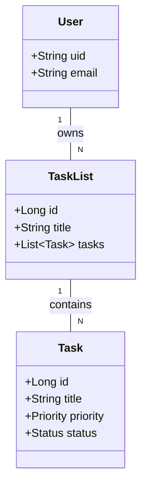

# PROJECT REPORT: Tasks Application

**TEAM MEMBERS:** [Please list your team members here]

## 1. ABSTRACT

This report details the successful completion of the full-stack Task Management Application. The project delivers a robust and scalable solution for task organization, built with a Spring Boot backend and a React/TypeScript frontend. The application provides users with an intuitive interface to manage task lists and individual tasks, track their progress, and customize their experience with features like a dark/light mode. The project successfully integrates a secure authentication system via Firebase and is built on a clean, maintainable architecture. This document outlines the implemented features, the final system architecture, the challenges encountered and their resolutions, the testing strategy employed, and potential directions for future development.

## 2. INTRODUCTION

### 2.1. Problem Addressed

In today's fast-paced environment, individuals and teams often struggle to keep track of their tasks and deadlines, leading to reduced productivity and a lack of clarity on project progress. This project was initiated to solve this problem by creating a simple, intuitive, and efficient tool for managing tasks, avoiding the complexity of many existing solutions.

### 2.2. Project Goals

The primary goals of this project were to:
-   Develop a full-stack application featuring a RESTful API backend and a responsive single-page application (SPA) frontend.
-   Implement core functionality for managing task lists and tasks.
-   Ensure a secure multi-user environment through robust user authentication.
-   Provide a high-quality user experience with features like progress tracking and theme customization.
-   Establish a well-defined and maintainable codebase for both backend and frontend.

## 3. IMPLEMENTED FEATURES

The application successfully implements the following ten features as planned in the project proposal:

1.  **Task List Management**: Users can create, update, and delete task lists, allowing for the effective categorization of tasks.
2.  **Task Management**: Within each list, users can add, edit, and remove individual tasks, each with a title, description, and due date.
3.  **Task Prioritization**: Tasks can be assigned a priority level (High, Medium, or Low), which is visually indicated in the UI to help users focus.
4.  **Task Status Tracking**: Tasks can be marked as 'Open' or 'Closed', providing clear and immediate progress tracking.
5.  **Task List Progress Tracking**: The system automatically calculates and displays a visual progress bar for each task list, reflecting the percentage of completed tasks.
6.  **Dark/Light Mode**: A theme-switching toggle was implemented on the frontend, allowing users to select their preferred UI theme, with the preference saved for future sessions.
7.  **User Authentication**: Secure user authentication was integrated using Firebase, ensuring that each user's data is private and accessible only after logging in.
8.  **RESTful API**: The backend exposes a complete and well-documented RESTful API that serves as the backbone for all application functionality.
9.  **Global Error Handling**: A centralized error handling mechanism was implemented in the backend to provide consistent and informative error responses to the frontend.
10. **CORS Configuration**: The backend was configured to correctly handle Cross-Origin Resource Sharing, allowing the frontend application to communicate with the API seamlessly.

## 4. SYSTEM ARCHITECTURE

The application was built using a modern client-server architecture, with a clear separation of concerns between the frontend and backend.

### 4.1. Backend Architecture

The backend is a Java Spring Boot application that follows a classic three-layer architecture:
-   **Controller Layer**: Exposes the RESTful API endpoints and handles HTTP requests and responses.
-   **Service Layer**: Contains the core business logic of the application.
-   **Repository Layer**: Manages data persistence and interacts with the PostgreSQL database.

### 4.2. Frontend Architecture

The frontend is a React application built with TypeScript, emphasizing a component-based structure.
-   **Components**: The UI is divided into reusable components (e.g., `TaskList`, `TaskItem`, `Header`).
-   **State Management**: React's Context API is used for managing global state, such as the current user and the UI theme.
-   **API Communication**: The `axios` library is used for making asynchronous requests to the backend REST API.

### 4.3. UML Diagrams

The following diagrams illustrate the final design of the system.

**Use-Case Diagram**
```mermaid
usecase "Tasks Application" {
    actor User

    rectangle "Task Management" {
        User -- (Manage Task Lists)
        User -- (Manage Tasks)
        User -- (View Task List Progress)

        (Manage Tasks) ..> (Set Task Priority) : <<extends>>
        (Manage Tasks) ..> (Set Task Status) : <<extends>>
    }

    rectangle "System" {
        User -- (Authenticate)
        User -- (Toggle Theme)
    }

    (Manage Task Lists) ..> (Authenticate) : <<includes>>
    (Manage Tasks) ..> (Authenticate) : <<includes>>
}
```

**Class Diagram**


## 5. CHALLENGES AND RESOLUTIONS

Several challenges were encountered and successfully resolved during the project lifecycle:

-   **Challenge**: Ensuring Data Privacy Between Users.
    -   **Resolution**: This was a critical security requirement. We implemented a strategy where the authenticated user's unique ID (from Firebase) was attached to every `TaskList` they created. All backend service methods were updated to include a check ensuring that a user could only access or modify task lists that were associated with their user ID.

-   **Challenge**: Cross-Origin Resource Sharing (CORS) Errors.
    -   **Resolution**: During initial integration, the browser blocked requests from the React frontend to the Spring Boot backend due to security policies. This was resolved by implementing a `WebConfig` class in Spring Boot with a `CorsFilter` bean, which explicitly permitted requests from the frontend's origin (`localhost:5173`).

-   **Challenge**: Managing Global UI State in React.
    -   **Resolution**: As the application grew, passing user and theme information down through many layers of components became inefficient. We resolved this by implementing React's Context API. We created a `ThemeContext` and an `AuthContext` to provide this global state to any component in the application that needed it, simplifying the component structure.

## 6. TESTING STRATEGY

A two-pronged testing strategy was employed to ensure application quality:

-   **Backend API Testing**: All REST API endpoints were rigorously tested using **Postman**. Test suites were created for each controller to verify correct responses for valid requests (e.g., `200 OK`, `201 Created`), client errors (e.g., `400 Bad Request`, `404 Not Found`), and authentication-related errors (`403 Forbidden`).
-   **Frontend Manual Testing**: The frontend user interface was thoroughly tested manually across different user flows. This included testing for:
    -   Correct rendering of task lists and tasks.
    -   Functionality of all buttons, forms, and interactive elements.
    -   Responsiveness of the UI on different screen sizes.
    -   Correct behavior of the theme-switching and authentication flows.

## 7. CONCLUSION AND FUTURE WORK

The project successfully meets all the objectives laid out in the proposal, delivering a functional and secure full-stack task management application. The final product is a testament to the effective integration of modern frontend and backend technologies.

There are several exciting avenues for future development that could further enhance the application:
-   **User Collaboration**: Introduce functionality to share task lists with other users for collaborative projects.
-   **Deadline Notifications**: Implement email or in-app notifications to alert users of approaching task deadlines.
-   **File Attachments**: Allow users to attach files (e.g., documents, images) to their tasks.
-   **Advanced Filtering**: Add more powerful filtering and sorting options on the frontend, such as sorting by due date or filtering by task title.

## 8. TEAM CONTRIBUTION

[Please detail the specific roles and responsibilities of each team member here. For example:

*   **[Team Member 1 Name]**: Backend development, database design, and API creation.
*   **[Team Member 2 Name]**: Frontend development, user interface design, and API integration.
*   **[Team Member 3 Name]**: Project management, testing, and documentation.]
