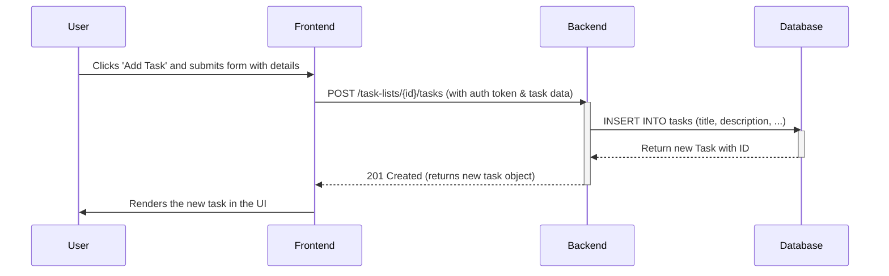
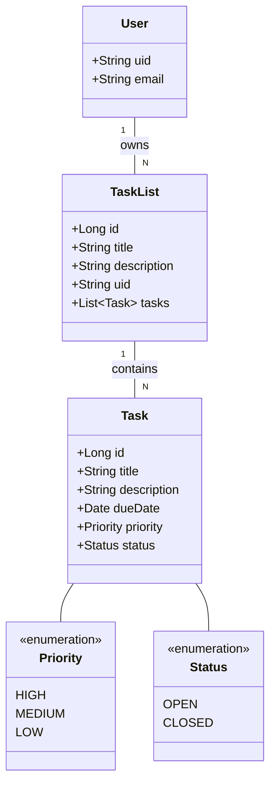

# Technical Specification: Tasks Application

This document provides a detailed technical overview of the Tasks Application, including system diagrams and interface mockups.

---

## 1. Technical Diagrams

### 1.1. Use Case Diagram

This diagram shows the primary actions a `User` can perform within the system.

```mermaid
usecase "Tasks Application" {
    actor User

    rectangle "Task Management" {
        User -- (Manage Task Lists)
        User -- (Manage Tasks)
        User -- (View Task List Progress)

        (Manage Tasks) ..> (Set Task Priority) : <<extends>>
        (Manage Tasks) ..> (Set Task Status) : <<extends>>
    }

    rectangle "System" {
        User -- (Authenticate)
        User -- (Toggle Theme)
    }

    (Manage Task Lists) ..> (Authenticate) : <<includes>>
    (Manage Tasks) ..> (Authenticate) : <<includes>>
}
```

### 1.2. Activity Diagram

This diagram illustrates the workflow for the **Task Management** feature, from user interaction to backend processing.

```mermaid
activityDiagram
    title Task Management

    |User| 
    start
    :Selects a Task List;

    |Frontend|
    :Fetches and displays tasks for the selected list;

    |User|
    :Decides to add, edit, or delete a task;
    switch (User Action)
    case (Add)
        :Clicks 'Add Task';
        |Frontend|
        :Displays a form for new task details;
        |User|
        :Fills in task details (title, description, etc.);
        :Submits form;
        |Frontend|
        :Sends POST request to /task-lists/{listId}/tasks;
        |Backend|
        :Receives request, creates new Task;
        :Adds Task to the Task List in Database;
        :Returns new Task object;
        |Frontend|
        :Receives response, adds new task to UI;

    case (Edit)
        :Selects an existing task and clicks 'Edit';
        |Frontend|
        :Displays form pre-filled with task details;
        |User|
        :Modifies task details;
        :Submits form;
        |Frontend|
        :Sends PUT request to /tasks/{id};
        |Backend|
        :Receives request, updates Task in Database;
        :Returns updated Task object;
        |Frontend|
        :Receives response, updates task in UI;

    case (Delete)
        :Selects a task and clicks 'Delete';
        |Frontend|
        :Shows confirmation dialog;
        |User|
        :Confirms deletion;
        |Frontend|
        :Sends DELETE request to /tasks/{id};
        |Backend|
        :Receives request, deletes Task from Database;
        :Returns success status;
        |Frontend|
        :Receives response, removes task from UI;
    endswitch

    |User|
    :Views updated tasks;
    stop
```

### 1.3. Sequence Diagram

This diagram details the sequence of interactions for a key scenario: **Creating a New Task**.



### 1.4. Class Diagram

This diagram shows the key data models (classes) and their relationships within the backend system.



---

## 2. Interface Mockups

### 2.1. Mockup - Main View

This text-based mockup illustrates the main application layout, including navigation and key functions.

```
+--------------------------------------------------------------------------+
| TasksApp         [user@email.com] [Toggle Theme] [Logout]                |
+--------------------------------------------------------------------------+
| TASK LISTS                               |   Work Project (75%)          |
|                                          |-------------------------------|
| > Work Project                           |                               |
|   Personal Errands                       | [ ] Buy milk (Priority: High) |
|   Groceries                              |     Due: 2023-12-01           |
|                                          |                               |
| + Create New List                        | [X] Finish report (Priority: Medium) |
|                                          |     Due: 2023-11-30           |
|                                          |                               |
|                                          |          [+ Add New Task]     |
+--------------------------------------------------------------------------+
```

### 2.2. Mockup - Feature Forms

These mockups show the layout for creating and editing tasks and task lists.

**Create/Edit Task List Form**
```
+------------------------------------+
| Create New Task List               |
+------------------------------------+
|                                    |
| Title: [ Work Project          ]   |
|                                    |
| Description:                       |
| [ Backend API implementation ]   |
|                                    |
|          [Save]  [Cancel]          |
+------------------------------------+
```

**Create/Edit Task Form**
```
+------------------------------------+
| Add Task to "Work Project"         |
+------------------------------------+
|                                    |
| Title: [ Implement auth        ]   |
|                                    |
| Description:                       |
| [ Secure endpoints with JWT  ]   |
|                                    |
| Due Date:   [ 2023-12-05 ]         |
|                                    |
| Priority:   [ High |v]             |
|                                    |
|          [Save]  [Cancel]          |
+------------------------------------+
```
